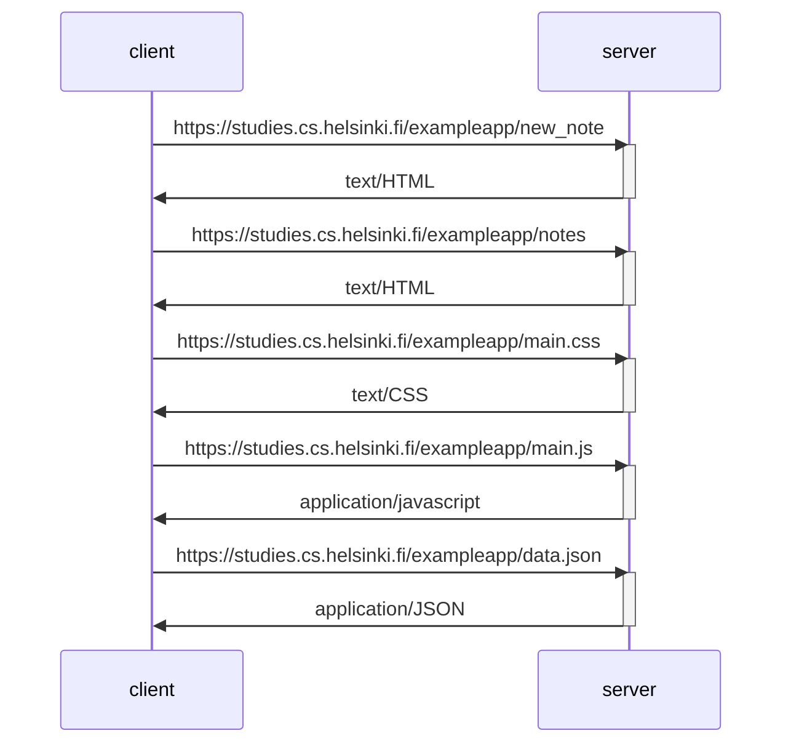

# New Note Diagram
## http request and response interacted by client and server

```mermaid
    sequenceDiagram
        participant client
        participant server

        client ->> server: https://studies.cs.helsinki.fi/exampleapp/new_note
        activate server
        server ->> client: text/HTML
        deactivate server
        client ->> server: https://studies.cs.helsinki.fi/exampleapp/notes
        activate server
        server ->> client: text/HTML
        deactivate server
        client ->> server: https://studies.cs.helsinki.fi/exampleapp/main.css
        activate server
        server ->> client: text/CSS
        deactivate server
        client ->> server: https://studies.cs.helsinki.fi/exampleapp/main.js
        activate server
        server ->> client: application/javascript
        deactivate server
        client ->> server: https://studies.cs.helsinki.fi/exampleapp/data.json
        activate server
        server ->> client: application/JSON
        deactivate server
```
