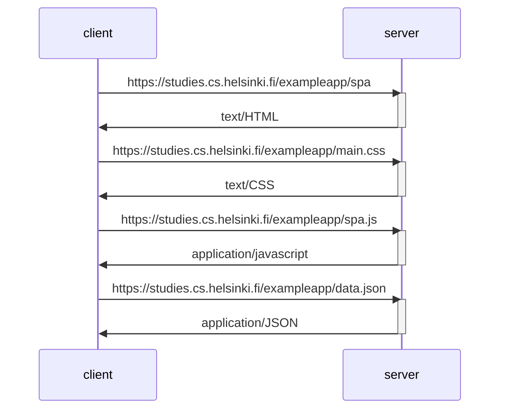

# Open a single page app

## Interaction between user and server when open a single page application

```mermaid
    sequenceDiagram
        participant client
        participant server

        client ->> server: https://studies.cs.helsinki.fi/exampleapp/spa
        activate server
        server ->> client: text/HTML
        deactivate server
        client ->> server: https://studies.cs.helsinki.fi/exampleapp/main.css
        activate server
        server ->> client: text/CSS
        deactivate server
        client ->> server: https://studies.cs.helsinki.fi/exampleapp/spa.js
        activate server
        server ->> client: application/javascript
        deactivate server
        client ->> server: https://studies.cs.helsinki.fi/exampleapp/data.json
        activate server
        server ->> client: application/JSON
        deactivate server
```