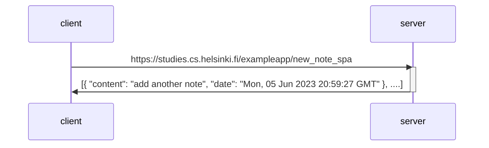

# Adding Note in Single Page App Diagram

## When user adds a new note in a single page app
...interaction between client and server

```mermaid
    sequenceDiagram
        participant client
        participant server

        client ->> server: https://studies.cs.helsinki.fi/exampleapp/new_note_spa
        activate server
        server ->> client: [{ "content": "add another note", "date": "Mon, 05 Jun 2023 20:59:27 GMT" }, ....]
        deactivate server
```

